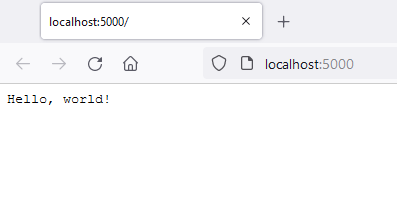

# Apps

## Hello World

The simplest way to get started with a web app is using the Minimal API syntax of .NET 6.

### 1: Create project

In Visual Studio, create a new project using the 'ASP.NET Core Empty' project template - make sure you select .NET 6.

### 2: Add package

Add the Jeebs.Apps.WebApps package using NuGet.

### 3: Add config

The jeebs library uses a custom json file for configuration.  Create jeebsconfig.json and add the following:

```javascript
{
  "jeebs": {
    "app": {
      "name": "Jeebs App"
    },
    "logging": {
      "minimumLevel": "Information",
      "console": true
    }
  }
}
```

### 4: Edit Program.cs

Add the following to your Program.cs file:

```csharp
var (app, log) = Jeebs.Apps.Builder.Create(args);

app.MapGet("/", () => "Hello, world!");

log.Information("Ready to go.");

app.Run();
```

### 5: Run app

Hit run and you should see something like this in your default browser (you may need to bypass the security warning first):



And something like this in the terminal output:

```csharp
[10:15:14 INF] Jeebs App | Application configured. | Jeebs.Apps.MinimalApiApp
[10:15:14 INF] Jeebs App | Ready to go. | Jeebs.Apps.MinimalApiApp
[10:15:14 INF] Now listening on: https://localhost:5000 | Microsoft.Hosting.Lifetime
[10:15:14 INF] Application started. Press Ctrl+C to shut down. | Microsoft.Hosting.Lifetime
[10:15:14 INF] Hosting environment: Development | Microsoft.Hosting.Lifetime
[10:15:14 INF] Content root path: C:\src\WebApplication1 | Microsoft.Hosting.Lifetime
```

Congratulations, you've run your first Jeebs app!
